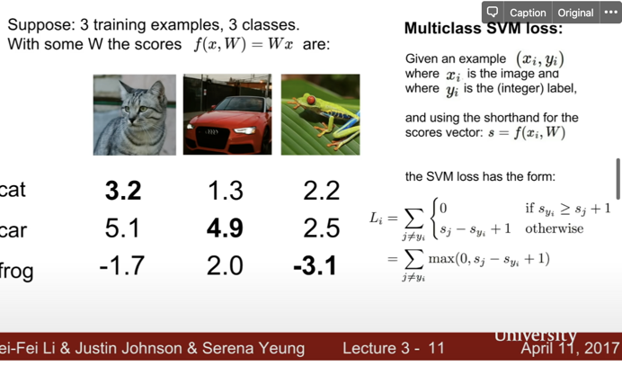

## hinge loss
### what?


### why?

### how?

If the score for correct category is greater than the incorrect category with a safe margin of 1 then the loss is zero.|
--- |
 |


## questions

### why does `delta` not matter?
It doesn't matter if it is 1 or whatever number it is.
```python
...
# delta doesn't matter. (lecture)
margin = scores[class_idx] - correct_class_score + 1  # note delta = 1
...
```

### using average
```python
# Right now the loss is a sum over all training examples, but we want it
# to be an average instead so we divide by num_train.
loss /= num_train
```
why? does it make the computation faster?


## numpy examples


### `np.dot` between a column vector and a matrix

```
np.ones((1,2))
Out[4]: array([[1., 1.]])
np.array([1, 2, 3, 4])
Out[5]: array([1, 2, 3, 4])
m1 = np.array([1, 2, 3, 4])
m2 = np.array([[1, 2, 3, 4], [1, 2, 3, 4], [1, 2, 3, 4], [1, 2, 3, 4]])
m1.dot(m2)
Out[8]: array([10, 20, 30, 40])
m3 = m1.dot(m2)
m3
Out[10]: array([10, 20, 30, 40])
m3.shape
Out[11]: (4,)

```