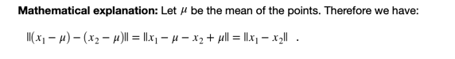

# k-Nearest Neighbor (kNN) exercise

*Complete and hand in this completed worksheet (including its outputs and any supporting code outside of the worksheet) with your assignment submission. For more details see the [assignments page](http://vision.stanford.edu/teaching/cs231n/assignments.html) on the course website.*

The kNN classifier consists of two stages:

- During training, the classifier takes the training data and simply remembers it
- During testing, kNN classifies every test image by comparing to all training images and transfering the labels of the k most similar training examples
- The value of k is cross-validated

In this exercise you will implement these steps and understand the basic Image Classification pipeline, cross-validation, and gain proficiency in writing efficient, vectorized code.

## classification with KNN classifier

some examples of CIFAR10 dataset, with labels|
---|
|

We would now like to classify the test data with the kNN classifier. Recall that we can break down this process into two steps: 

1. First we must compute the distances between all test examples and all train examples. 
2. Given these distances, for each test example we find the k nearest examples and have them vote for the label

Lets begin with computing the distance matrix between all training and test examples. For example, if there are **Ntr** training examples and **Nte** test examples, this stage should result in a **Nte x Ntr** matrix where each element (i,j) is the distance between the i-th test and j-th train example.

**Note: For the three distance computations that we require you to implement in this notebook, you may not use the np.linalg.norm() function that numpy provides.**

First, open `cs231n/classifiers/k_nearest_neighbor.py` and implement the function `compute_distances_two_loops` that uses a (very inefficient) double loop over all pairs of (test, train) examples and computes the distance matrix one element at a time.

## **Inline Question 1** 

visualisation of L2 `dists` between `X` and `X_train`|
---|
|

Notice the structured patterns in the distance matrix, where some rows or columns are visible brighter.
 (Note that with the default color scheme black indicates low distances while white indicates high distances.)

- What in the data is the cause behind the distinctly bright rows?

> Some images in the test set that have higher RGB values than most of the images in the training set 
> is the cause of the distinctively bright rows. -> implications? novel test data?

- What causes the columns?
> Vice versa; Some images in the training\ set that have higher RGB values than most of the images in the test set 
> is the cause of the distinctively bright rows. -> implications??
                  

## **Inline Question 2**

We can also use other distance metrics such as L1 distance.
For pixel values $p_{ij}^{(k)}$ at location $(i,j)$ of some image $I_k$, 

the mean $\mu$ across all pixels over all images is $$\mu=\frac{1}{nhw}\sum_{k=1}^n\sum_{i=1}^{h}\sum_{j=1}^{w}p_{ij}^{(k)}$$
And the pixel-wise mean $\mu_{ij}$ across all images is 
$$\mu_{ij}=\frac{1}{n}\sum_{k=1}^np_{ij}^{(k)}.$$
The general standard deviation $\sigma$ and pixel-wise standard deviation $\sigma_{ij}$ is defined similarly.

Which of the following preprocessing steps will not change the performance of a Nearest Neighbor classifier that uses L1 distance? Select all that apply.
1. Subtracting the mean $\mu$ ($\tilde{p}_{ij}^{(k)}=p_{ij}^{(k)}-\mu$.)

> L1 distannce won't change, so the performance won't change.

mathematical expl|
--- |
|

2. Subtracting the per pixel mean $\mu_{ij}$  ($\tilde{p}_{ij}^{(k)}=p_{ij}^{(k)}-\mu_{ij}$.)

3. Subtracting the mean $\mu$ and dividing by the standard deviation $\sigma$.
> L1 distance will change?

mathematical expl|
--- |
| 

4. Subtracting the pixel-wise mean $\mu_{ij}$ and dividing by the pixel-wise standard deviation $\sigma_{ij}$.
5. Rotating the coordinate axes of the data.
> L1 distance will change.

mathematical expl|
--- |
|

- reference: https://github.com/jariasf/CS231n/blob/master/assignment1/knn.ipynb

## Cross-validation

[Setting hyperparameters with cross validation](https://youtu.be/OoUX-nOEjG0?t=2089)|
---|
|

We have implemented the k-Nearest Neighbor classifier 
but we set the value k = 5 arbitrarily. We will now determine the best value of this hyperparameter with cross-validation.

result of cross validation|
---|
|

## **Inline Question 3**

Which of the following statements about $k$-Nearest Neighbor ($k$-NN) are true in a classification setting,
 and for all $k$? Select all that apply.
 
>  True: 2, 4. False: 1, 3
 
1. The decision boundary of the k-NN classifier is linear.
> this is not true. (How could I explain this mathematically?)

2. The training error of a 1-NN will always be lower than that of 5-NN.
> this is true, because the prediction output of 1-NN for an example is the label of the the example itself, which is
> the answer for the given example. Making predictions with 1-NN on training set will always output a correct answer.

3. The test error of a 1-NN will always be lower than that of a 5-NN.
> This is not necessarily true. Counter example: if, for a particular testing example, 5-nearest-neighbours to
> the test sample were found to be: `[correct, incorrect1, incorrect2, incorrect3, incorrect4]`,
> then 5-NN would output an incorrect answer, whereas 1-NN would output a correct answer for the same testing example.

4. The time needed to classify a test example with the k-NN classifier grows with the size of the training set.
> This is true. Although we can reduce the time it takes for `prefict` by parallel execution using vectorization technique,
> the number of distances to compute is `num_test` * `num_train`, which invariably grows with the size of test set and 
> train set.

## numpy examples
### `np.array_split()` examples
